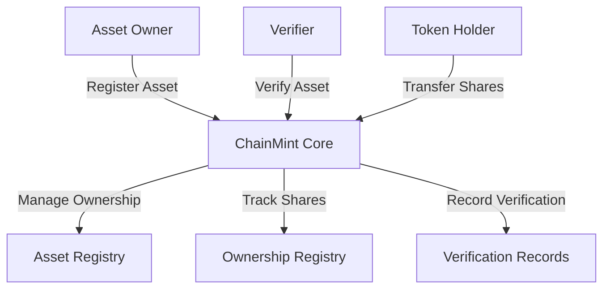

# ChainMint Asset Tokenization Platform

A comprehensive blockchain platform for creating, managing, and trading tokenized physical assets through secure verification and ownership mechanisms.

## Overview

ChainMint enables the tokenization of real-world assets like real estate, art, collectibles, and commodities on the blockchain. The platform bridges the gap between physical assets and digital ownership by providing:

- Secure asset registration and verification
- Support for both divisible and indivisible assets
- Transparent ownership tracking
- Flexible transfer mechanisms
- Revenue distribution for fractional ownership
- Robust access control and security features

## Architecture

The platform is built around a core smart contract that manages asset registration, verification, and ownership transfers.



### Core Components

1. **Asset Registry**: Stores metadata and status of all tokenized assets
2. **Ownership Registry**: Tracks ownership shares for divisible assets
3. **Verification System**: Manages asset verification by approved verifiers
4. **Access Control**: Handles permissions and roles

## Contract Documentation

### chainmint-core.clar

The central contract managing all platform operations.

#### Key Features:

- Asset registration and management
- Verification process handling
- Ownership transfer mechanisms
- Revenue distribution for divisible assets

#### Access Control Levels:

- Contract Owner: Platform administration
- Approved Verifiers: Asset verification
- Asset Creators: Asset management
- Token Holders: Ownership transfers

## Getting Started

### Prerequisites

- Clarinet
- Stacks wallet for deployment
- Access to Stacks blockchain

### Basic Usage

1. **Register an Asset**
```clarity
(contract-call? .chainmint-core register-asset 
    ASSET-TYPE-DIVISIBLE 
    "Premium Real Estate" 
    "Luxury apartment in prime location" 
    (some "https://asset-docs.example.com/123") 
    u10000 
    u250)
```

2. **Verify an Asset**
```clarity
(contract-call? .chainmint-core verify-asset 
    u1 
    "Asset verified in person" 
    (some u1000000) 
    u1000)
```

3. **Transfer Shares**
```clarity
(contract-call? .chainmint-core transfer-shares 
    u1 
    'SP2J6ZY48GV1EZ5V2V5RB9MP66SW86PYKKNRV9EJ7 
    u100)
```

## Function Reference

### Administrative Functions

- `set-contract-owner`: Update the contract administrator
- `set-verifier-status`: Manage approved verifiers
- `set-asset-freeze`: Emergency freeze for assets

### Asset Management

- `register-asset`: Create new asset records
- `update-asset-details`: Modify asset information
- `verify-asset`: Provide asset verification
- `reject-verification`: Reject asset verification

### Ownership Operations

- `transfer-shares`: Transfer ownership of divisible assets
- `transfer-asset`: Transfer ownership of indivisible assets
- `distribute-revenue`: Handle revenue distribution

### Query Functions

- `get-asset`: Retrieve asset details
- `get-verification`: Get verification information
- `get-principal-ownership`: Check ownership details
- `get-ownership-percentage`: Calculate ownership percentage

## Development

### Local Testing

1. Initialize Clarinet project:
```bash
clarinet new chainmint && cd chainmint
```

2. Deploy contracts:
```bash
clarinet console
```

3. Run tests:
```bash
clarinet test
```

### Security Considerations

1. **Access Control**
   - Only approved verifiers can verify assets
   - Only asset creators can modify their assets
   - Contract owner has emergency freeze capabilities

2. **Asset Protection**
   - Locked assets cannot be transferred
   - Frozen assets are completely restricted
   - Verification expiry prevents stale attestations

3. **Ownership Safety**
   - Share transfers require sufficient balance
   - Asset transfers require verified status
   - Revenue distribution limited to asset creators

4. **Limitations**
   - No direct integration with payment systems
   - Verification requires off-chain coordination
   - Asset freezing is centralized with contract owner